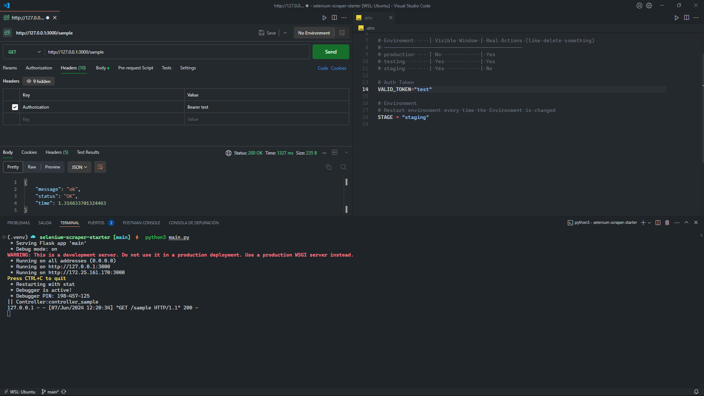
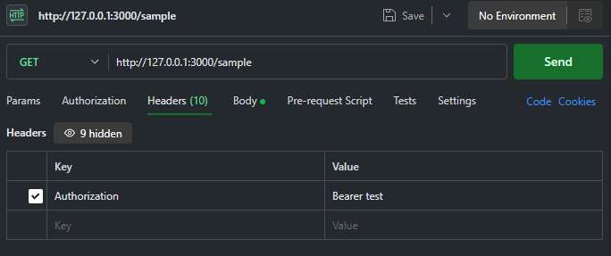

# Selenium Scraper Starter

This repository provides a foundation for building robust and scalable web scrapers using Selenium and Flask. It emphasizes best practices including environment management, configuration with Docker, and a well-structured project layout.

## Key Features

- **Selenium Automation:** Efficiently interact with dynamic webpages using Selenium's browser automation capabilities.
- **Flask Backend:** Create a RESTful API with Flask to manage scraper execution, authorization, and logging.
- **Bearer Authentication:** Implement a secure mechanism for API access using bearer tokens.
- **Environment Management:** Facilitate deployment across different environments (production, staging) using environment variables.
- **Docker Configuration:** Streamline containerization for a consistent and portable development experience.
- **Logging System:** Track scraper activities and errors for debugging and monitoring.

## Local Setup

### Prerequisites

Before diving in, ensure you have the following tools installed:

- **Python (version 3.x recommended):** Download and install from https://www.python.org/downloads/.
- **.env file:** Create a `.env` file to store environment variables (refer to `.env.example` for guidance).
- **HTTP Client (Postman recommended):** Use an HTTP client like https://www.postman.com/ to send requests to the Flask API.
- **Chrome Browser:** Download and install the latest version from https://www.google.com/chrome/.

### Create a Virtual Environment

We use a module named virtualenv which is a tool to create **isolated Python environments**. Virtualenv creates a folder that contains all the necessary executables to use the packages that a Python project would need.

```bash
python3 -m venv <whatever_virtual_environment_name>
```

### Activate virtual environment

```bash
source <whatever_virtual_environment_name>/bin/activate   # for Unix/Linux
.\<whatever_virtual_environment_name>\Scripts\activate    # for Windows
```

### Install project libraries

```bash
pip install -r .\requirements.txt
```

### Run main file

```bash
python3 .\main.py
```

Now, the server is accessible at `http://localhost3000`

### First Call





### Make your firsts changes

1. The first thing is to add your .env file. You can add a invented bearer token to get started

2. Then configure the base url in the utils/config.py file

3. In order to work on your project, you must add an endpoint to main.py.

4. Next, create a controller, and add the different web actions on the controller. It is recommended to do actions with few steps, to be able to modularize your code, and not repeat code in the future.

## Project Structure

```bash
├─── main.py                   # Entry point for the Flask application
├─── .vscode                   # Configuration for Visual Studio Code (optional)
├─── actions                   # Contains scraper actions (logic for data extraction)
├─── controller                # Functions handling API requests
├─── temp_downloads            # Temporary files created during scraping
└─── utils                     # Reusable helper functions
```

## Bibliography

- [Selenium Web Page](https://selenium-python.readthedocs.io/): Main bot technology
- [Selenium Tutorial](https://youtube.com/playlist?list=PLheIVUbpfWZ17lCcHnoaa1RD59juFR06C&si=TTyB-dQQFl38tXO2)
- [Flask](https://flask.palletsprojects.com/en/3.0.x/): Core technology for creating a REST API server

## Commond Errors

```bash
Traceback (most recent call last):
  File "/home/ismola/dev/siryus-botst/utils/logging_config.py", line 30, in configure_logger
    logging.basicConfig(filename=log_filepath, level=logging.INFO,
  File "/usr/lib/python3.10/logging/__init__.py", line 2040, in basicConfig
```

`The user who is running it does not have permissions, or the chromedriver has not been installed by the same user who runs the python`

```bash
ERROR: local variable 'driver' referenced before assignment
```

`It may be because the script are taking the chromedriver from the wrong place`

### Steps

#### 1. Check this script. Type python, and paste the content. If there are any errors, continue to the next step

```bash
# Download chromedriver You can also use this script that downloads the latest version automatically:
# https://github.com/Ismola/linux-chromedriver-updater
wget https://chromedriver.storage.googleapis.com/131.0.6778.264/chromedriver_linux64.zip
unzip chromedriver_linux64.zip
sudo mv chromedriver /usr/local/bin/
sudo chmod +x /usr/local/bin/chromedriver

#Use chromedriver
from selenium.webdriver.chrome.service import Service
from selenium import webdriver
from selenium.webdriver.chrome.options import Options

options = Options()
options.add_argument("--no-sandbox")
options.add_argument("--disable-dev-shm-usage")
options.add_argument("--headless")

# Ruta al chromedriver descargado manualmente
service = Service("/usr/local/bin/chromedriver")
driver = webdriver.Chrome(service=service, options=options)

driver.get("https://www.google.com")
print(driver.title)
driver.quit()
```

#### 2. To have the python script install the chromedriver again, delete this folder

```bash
rm -rf ~/.wdm

```
